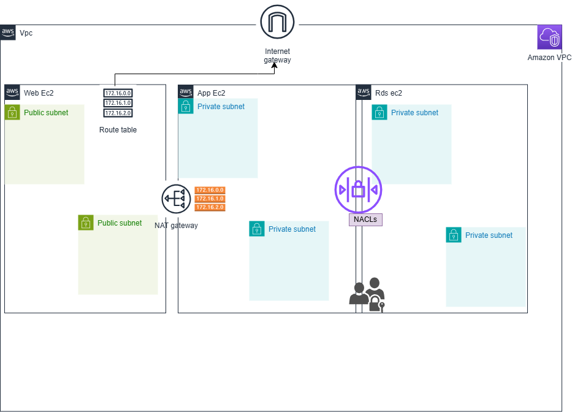

✅WEEK 1 MENTORSHIP PROJECTS BY GROUP B TEAM

✅GROUP B TEAM: Fagoroye Sanumi O.
              Lawal Jonathan

✏️TOPIC: Deploy a Secure 3-tier Infrastructure on AWS using Terraform

📘SCOPE: We'll be launching two EC2 instances: one in a public subnet and the other in a private subnet. The EC2 instance in the public subnet will have a public IP address, allowing it to access the internet—provided the VPC is configured with an internet gateway and an appropriate route is set from the subnet to the gateway.

The private EC2 instance, on the other hand, will not have a public IP, keeping it isolated from direct internet access. However, it still needs internet connectivity for tasks like downloading security patches. To enable this, we'll set up a NAT gateway.

The NAT gateway will reside in the public subnet and will be associated with an Elastic IP (a static IP address). We'll then update the route table for the private subnet to direct traffic through the NAT gateway. This allows the private EC2 instance to access the internet securely for updates and software installations

3-tier-Architecture

✏️EXPLANATION OF EACH TERRAFORM RESOURCE USED:
✏️Terraform Resource Documentation
📌Resource: aws_vpc
  Purpose: Creates a Virtual Private Cloud (VPC) to isolate your network environment in AWS.

Key Arguments:
cidr_block= The IPv4 CIDR block for the VPC.
enable_dns_support= Enables DNS support in the VPC.
enable_dns_hostnames= Enables DNS hostnames in the VPC.

This VPC forms the basis of your network, allowing you to create subnets, gateways, and control routing.

📌Resource: aws_subnet
  Purpose: Creates a subnet within a VPC to divide the network into smaller segments.

Key Arguments:
vpc_id — The VPC ID where the subnet will be created.
cidr_block — The CIDR block of the subnet.
availability_zone — The AWS Availability Zone for the subnet.

📌Resource: aws_internet_gateway
  Purpose: Creates an Internet Gateway to enable internet access for resources inside the VPC.

📌Resource: aws_route_table
Purpose: A route table contains a set of rules (routes) that determine how network traffic is directed within your VPC. Each subnet must be associated with one route table, which controls how traffic leaving the subnet is routed.

📌Resource: aws_security_group
Purpose: Controls inbound and outbound traffic for your instances (like a virtual firewall).

Key Arguments:
vpc_id — The VPC ID to which the security group belongs.
ingress — Rules to allow inbound traffic.
egress — Rules to allow outbound traffic.

🔹Resource: aws_instance
Purpose: Launches an EC2 instance.

Key Arguments:
ami — The Amazon Machine Image ID.
instance_type — The EC2 instance type.
subnet_id — The subnet where the instance is launched.
security_groups or vpc_security_group_ids - Security groups attached.

🔹Resource: aws_network_acl
Purpose: Network ACLs are stateless firewalls that control inbound and outbound traffic at the subnet level in your VPC. Unlike security groups (which are stateful and operate at the instance level), NACLs operate on the subnet and require explicit rules for both inbound and outbound traffic.

🔹Resource: aws_network_acl_association
Purpose: Associates the NACL with a subnet. NACLs is used for subnet-level traffic filtering, good for an extra layer of security or controlling traffic flow between subnets.

🔹provider
Purpose: A provider is a plugin that Terraform uses to interact with cloud platforms or services, like AWS, Azure, Google Cloud, or others. It defines the infrastructure API endpoints, authentication, and how Terraform talks to those services.

🔹output
Purpose:Outputs allow you to extract and display useful information from your Terraform state after running terraform apply. Outputs are helpful to share information between configurations or just to display things like IP addresses, IDs, or DNS names.

🔹 Resource: aws_nat_gateway
The NAT Gateway enables instances in a private subnet to access the internet (e.g., for updates or external APIs), while preventing inbound traffic from the internet.

 NAT Gateway + Route Tables = Internet Gateway
This configuration enables private subnets to access the internet through a NAT Gateway, while public subnets access the internet directly via an Internet Gateway.

🧱 Resources
aws_nat_gateway.public: NAT Gateway deployed in public subnet.

aws_route_table.public: Public route table for web-tier resources.

aws_route_table.private: Private route table for app/DB tiers.

aws_route.private-internet_out: Private → Internet via NAT.

aws_route.public_internet_access: Public → Internet via IGW.

aws_route_table_association.*: Associates subnets with the correct route table.

📡 Network Flow
Public subnet traffic: 0.0.0.0/0 → Internet Gateway

Private subnet traffic: 0.0.0.0/0 → NAT Gateway → IGW.