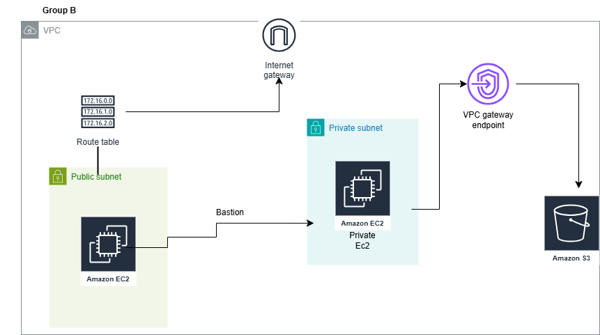

✅WEEK 2 MENTORSHIP PROJECT BY GROUP B TEAM

✅GROUP B TEAM: Fagoroye Sanumi O.
               &  Lawal Jonathan
               
✏️TOPIC: Secure Access from EC2 to S3 using VPC Gateway Endpoints

🔧 Project Overview
This project uses Terraform to provision a secure AWS environment consisting of:

🛡️ An EC2 bastion host for controlled SSH access

🔒 A private EC2 instance hosted in an isolated subnet

📦 S3 buckets for object storage

🔐 An IAM role with scoped permissions to enable EC2-to-S3 access

Additionally, the setup demonstrates how to securely enable the private EC2 instance to access S3 without requiring internet connectivity. This is achieved using a VPC Gateway Endpoint for S3, which routes all S3 traffic through the AWS private network, completely bypassing the public internet

EXPLANATION OF THE SECURITY BENEFITS OF USING A VPC ENDPOINT

🔒 1. Prevents Exposure to the Public Internet
Without a VPC Endpoint:
Private EC2 instances typically need a NAT Gateway or Internet Gateway to communicate with S3, which sends traffic over the public internet — making it susceptible to threats like man-in-the-middle attacks.

With a VPC Endpoint:
All communication between your VPC and S3 remains on the secure AWS internal network. No public internet is involved, significantly reducing the risk of external attacks. VPC endpoints establish a private, direct link between your VPC and AWS services, avoiding the need to send traffic over the public internet.

🛡️ 2. Granular Access Control with IAM and Endpoint Policies
VPC endpoints allow you to enforce strict access controls using both IAM roles and endpoint-specific policies. You gain detailed control over which services can be accessed, when, and how — improving overall network governance and reducing risk.
You can, for example, restrict access to specific S3 buckets or limit permissions to only certain actions like GetObject.

🔐 3. Enforced Bucket-Level Restrictions
S3 bucket policies can be configured to deny all access unless requests originate from a specific VPC endpoint.
This ensures that even if credentials are compromised, access is only allowed from within your private network.

🔍 4. Improved Monitoring and Auditing
Access via a VPC endpoint is fully auditable through AWS CloudTrail and VPC Flow Logs.
You can track:

Which EC2 instances accessed S3

The time and nature of the request

The specific VPC endpoint used

✅Proof that an EC2 instance can access an S3 bucket privately and perform read/write operations using a shell script

